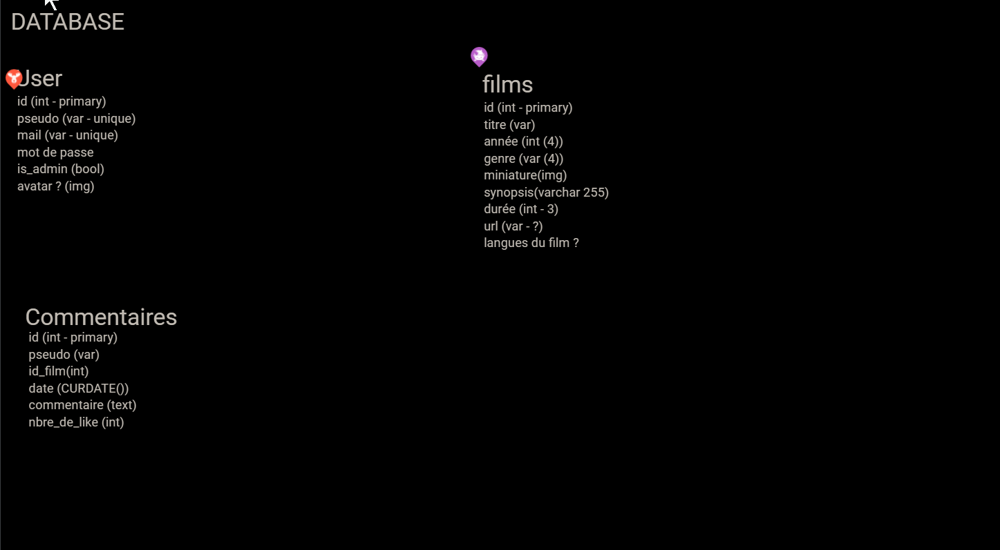
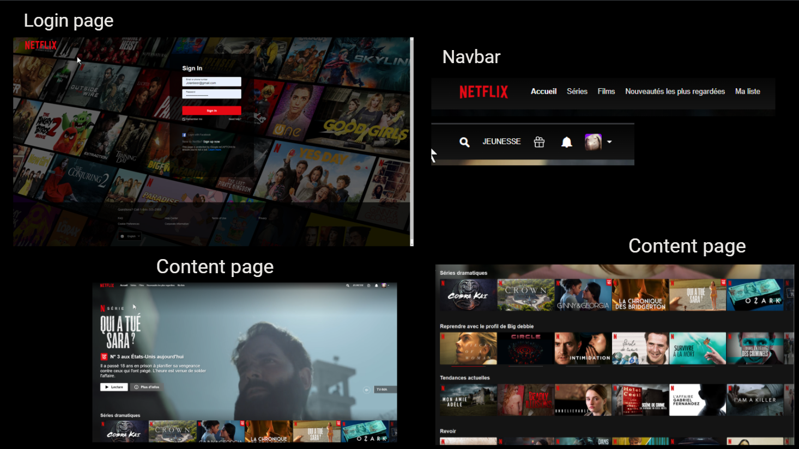
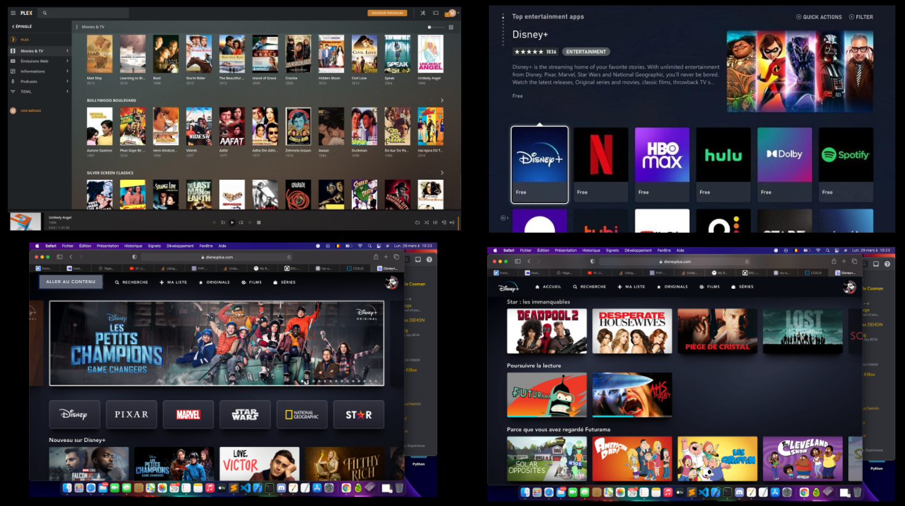

# Projet PHP : "GetFlix"

Retrouvez ici toutes les informations concernant le site de streaming et les techniques utilisées pour réaliser celui-ci.

Ce site de streaming créé par... 
#### Nathalie Anneessens | Marc Houtreille | Thomas Quertinmont | Christian Jadot

***

## Nom du projet

"GETFLIX"

## Voici l'URL du site réalisé
[Nous vous présentons "GetFlix"](http://ed37803c20a8.ngrok.io/getflixproject/)

## Github
L'ensemble des éléments "Pages / Dossiers / Images" ont été placés sur Github
Voici le repo sur [Github](https://github.com/MarcHoutreille/getflixProject)

## Code et langages utilisés
HTML5 / CSS3 / BOOSTRAP / JAVASCRIPT / PHP

## Réalisation
Ce site de streaming a été réalisé grâce à HTML/CSS3/BOOSTRAP/JAVASCRIPT/PHP et construit dans Visual Studio Code.

## Les Étapes
1. Etude du projet et création du Jamboard
2. Discussion sur le travail à réaliser
3. Répartition des tâches Front / Back
4. Création du repo
5. Démarrage de la réalisation

## Organisation du travail
- Répartition des tâches :
  - **Main FrontEnd :** Nathalie Anneessens & Christian Jadot
  - **Main BackEnd :** Marc Houtreille & Thomas Quertinmont
  - **Project Manager :** Marc Houtreille

- Détails des réalisations
  - FrontEnd :
    - Création du layout, validation et démarrage de la mise en HTML5/CSS3.
    - Récupération de tous les éléments visuels.
    - Création des différentes zones du site.
    - Structurer l'HTML en correspondance des actions Javascript, implémentation de tous les éléments utiles.
    - Fixer au mieux les éléments pour @media.
  - BackEnd :
    - Démarrage du codage en Javascript et PHP
    - Structurer le Javascript en correspondance des balises HTML.
    - Utilisation du Javascript en complément du PHP pour certaines fonctionnalités (recherche par critère)

## Jamboard

## Color Palette

#000000 - black text

#3D2645

#832161

#DA4167

#F0EEFF4 - white bg

## Licences
### Images
Toutes les images utilisées proviennent de [Google Image](https://www.google.com/imghp?hl=fr)

### Videos
Toutes les vidéos utilisées proviennent du site [Youtube](https://www.youtube.com) 

